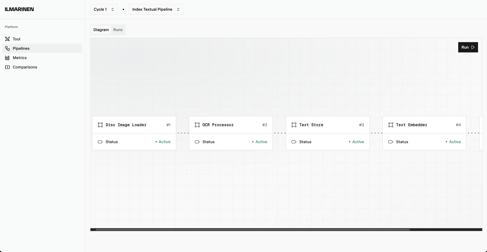
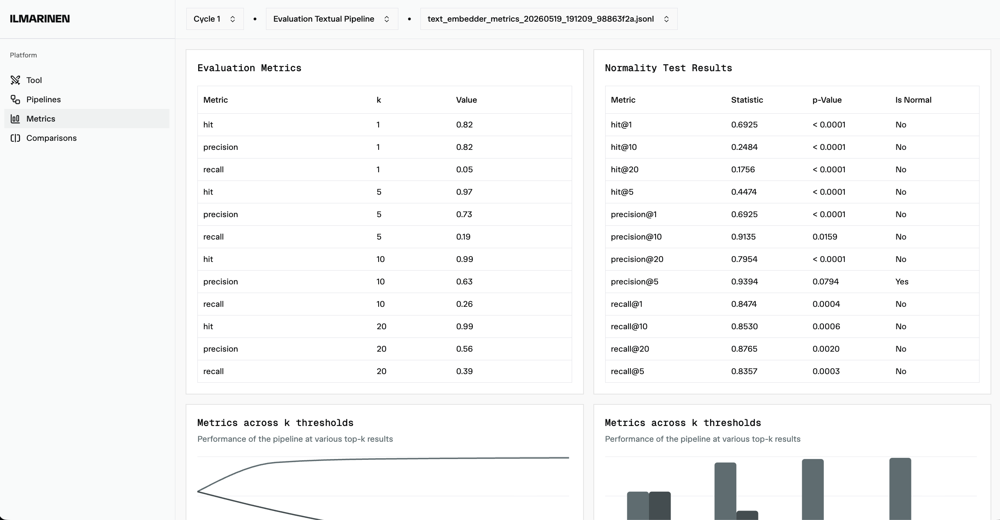
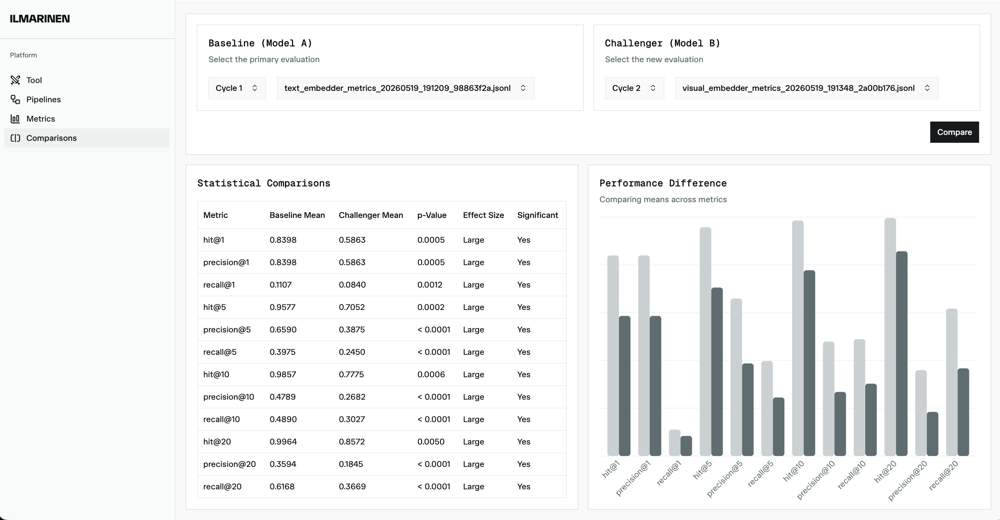

# Ilmarinen

Ilmarinen is a web-based application developed as part of a bachelor's thesis following the design science research methodology and in collaboration with a software testing consultancy company. It allows users to upload an image of a bug and retrieve potential duplicates from a pre-indexed dataset of bug report images. The application offers the choice of three detection pipelines, each corresponding to a different strategy developed iteratively across the design cycles. After processing, Ilmarinen returns the top-20 most similar images, ranked by similarity score in descending order. Users can then preview each retrieve image to manually verify the results.

## Design

A builder pattern was adopted and implemented within a pipeline runner abstraction. Using interfaces, the design simplifies the definition, extension, and swapping of pipeline components.

### Cycle 1 index pipeline code snippet

```python
    (
        PipelineRunner(name="Index Text-based Pipeline")
        .add_source(
            source=ImageLoaderPipelineAdapter(
                loader=DiscImageLoader(root_dir=cfg.input_dir, subdir="index")
            )
        )
        .add_step(step=OcrPipelineAdapter(ocr=ocr))
        .add_step(
            step=StorePipelineAdapter(
                store=JsonStore(
                    file_path=processed_path,
                    serializer=processed_text_serializer,
                )
            )
        )
        .add_step(step=EmbedderPipelineAdapter(embedder=SBERTTextEmbedder()))
        .add_step(
            step=FaissVectorStorePipelineAdapter(
                index=FaissIndex(
                    create_index(cfg.faiss_index_name, dim=cfg.text_out_dim)
                ),
                save_index_results_to=cfg.cycle_1_index_dir,
            )
        )
        .run()
    )
```

### Cycle 1 query pipeline code snippet

```python
    result = (
        PipelineRunner(name="Query Text-Based Pipeline")
        .add_step(step=ImagePassThroughPipelineAdapter(image=image))
        .add_step(step=OcrPipelineAdapter(ocr=ocr))
        .add_step(step=ocr_capture)
        .add_step(step=EmbedderPipelineAdapter(embedder=SBERTTextEmbedder()))
        .add_step(
            step=FaissResultsRetrievalPipelineAdapter(
                index=FaissIndex(),
                index_base_dir=cfg.cycle_1_index_dir,
                top_k=max(cfg.default_k_values),
            )
        )
        .run()
    )
```

## Demo

### Pipelines page

The `Pipelines` page allows a user to inspect the components of each pipeline and run a selected pipeline.

<p align="center">
  
</p>

### Metrics page

The `Metrics` page shows evaluation metrics, normality test results, metrics across k thresholds, and cluster scores for each retrieval metric. A user can select a cycle which metrics should be displayed on the page.

<p align="center">
  
</p>

### Cycles comparison view

The `Comparisons` page allows a user to compare between two cycles and inspect statistical differences for every retrieval metric.

<p align="center">
  
</p>

### Team
- Szymon Witt
- Charles Jarju
- Stefán Ólafur Ingimarsson
